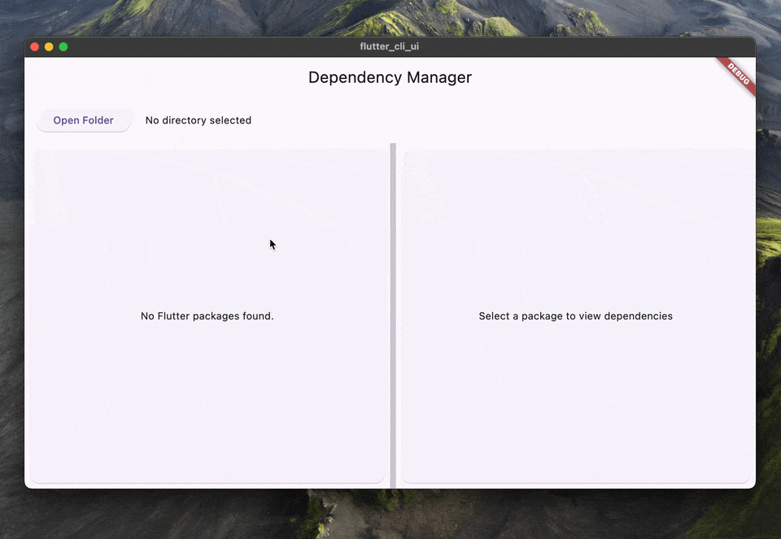
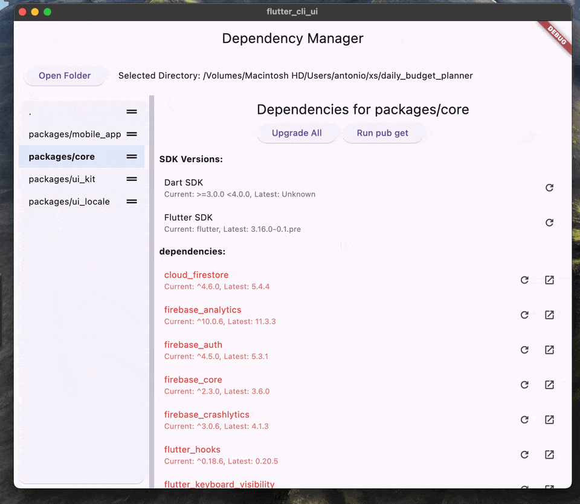

<a href="https://app.commanddash.io/agent/github_arenukvern_flutter_cli_ui"></a>
[](https://github.com/mefengl/made-by-ai)
<a title="Discord" href="https://discord.com/invite/y54DpJwmAn" ></a>
[](CODE_OF_CONDUCT.md)

# Flutter CLI UI

Flutter CLI UI is a graphical user interface application to manage dependencies for multiple Flutter projects within a single repository.
Inspired by [Vue CLI UI](https://cli.vuejs.org/dev-guide/ui-api.html).

## Features

- Open and scan a directory for Flutter packages
- List all Flutter packages found in the selected directory
- Display dependencies, dev dependencies, and overridden dependencies for each package
- Show current and latest versions of dependencies
- Upgrade individual dependencies to their latest versions
- Upgrade all dependencies in a package at once
- Run 'pub get' for selected packages

## Demo

### Opening a Folder



### Upgrading Packages



## Getting Started

### Prerequisites

- Flutter SDK (latest stable version)
- Dart SDK (latest stable version)

### Installation

1. Clone the repository:

   ```
   git clone https://github.com/arenukvern/flutter_cli_ui.git
   ```

2. Navigate to the project directory:

   ```
   cd flutter_cli_ui
   ```

3. Get the dependencies:
   ```
   flutter pub get
   ```

### Running the App

To run the app in debug mode:

```
flutter run
```

To build a release version:

```
flutter build <platform> --release
```

Replace `<platform>` with your target platform (e.g., `windows`, `macos`, `linux`).

## Usage

1. Launch the app
2. Click on "Select Directory" to choose the root folder of your Flutter projects
3. The app will scan for Flutter packages and display them in the left panel
4. Select a package to view its dependencies in the right panel
5. Use the "Upgrade" button next to each dependency to update it individually
6. Use the "Upgrade All" button to update all dependencies in the selected package
7. Click "Run pub get" to fetch the latest packages after upgrading

## Contributing

We welcome contributions to Flutter CLI UI! Please see our [Contributing Guidelines](CONTRIBUTING.md) for more details on how to get started.

## Code of Conduct

Please read our [Code of Conduct](CODE_OF_CONDUCT.md) to understand the standards of behavior we expect from contributors and users of this project.

## License

This project is licensed under the MIT License - see the [LICENSE](LICENSE) file for details.

## Terms and Conditions

By using this software, you agree to our [Terms and Conditions](TERMS_AND_CONDITIONS.md).

## Acknowledgments

- Thanks to all contributors who have helped shape Flutter CLI UI
- The Flutter team for providing an awesome framework
- [Vue CLI UI](https://cli.vuejs.org/dev-guide/ui-api.html) for the inspiration

## Contact

If you have any questions, feel free to reach out in the [Discord](https://discord.com/invite/y54DpJwmAn).

Happy coding!

Made with Flutter & ❤️ by [Arenukvern](https://github.com/arenukvern)
